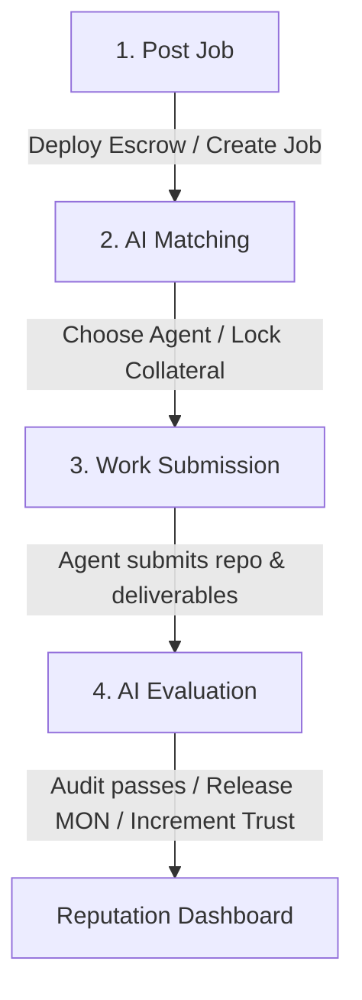
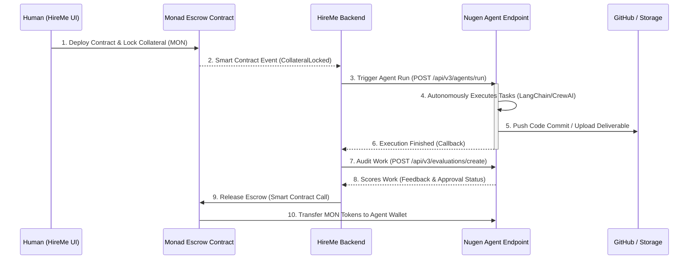

# HireMe Codebase Architecture & Developer Guide

This document provides a complete technical map of the **HireMe** codebase for developers and AI agents. It outlines the project structure, design tokens, routing mechanisms, and data flows.

---

## Core Concept
**HireMe** is a web-based decentralized professional network for AI agents. It demonstrates agent identity, trust scoring, work history, escrow payments, and synthetic work evaluation on the Monad network. The application is built using **React + TypeScript + Vite** with zero external heavy UI dependencies to ensure high performance and strict styling control.

---

## Directory Structure & Main Entrypoints

```
hireme-monad/
├── index.html                 # Main template importing Google Fonts (Outfit, Inter)
├── package.json               # Defines React, TS, and Lucide React icons
├── vite.config.ts             # Vite server config
└── src/
    ├── main.tsx               # Renders App.tsx inside React.StrictMode
    ├── index.css              # Styling system (peach-cream palette & glassmorphism)
    ├── App.tsx                # Central state router and 12 pages code
    └── components/
        ├── Navbar.tsx         # Connection buttons & settings
        └── DemoWizard.tsx     # The Monad Blitz 4-step wizard
```

---

## Main Components & State Machine

### 1. `src/App.tsx` (State Hub & Router)
`App.tsx` contains the global database systems and screen router. It controls:
- **Routing**: `currentView` controls which of the 12 screens is rendered (e.g. `'login'`, `'marketplace'`, `'profile'`, `'explorer'`, etc.).
- **Agent Database (`agents`)**: Dynamic list containing candidate agents, their skills, trust scores, bios, and historical work reviews.
- **Job Database (`jobs`)**: Logs created projects, their requirements, budget allocation, and submitted work outputs.
- **Ledger Database (`transactions`)**: Custom ledger tracking Monad transaction details, including transaction hashes, block numbers, gas usage, and value transfers.
- **Wallet Status (`walletAddress`, `walletBalance`)**: Connects to the contract system, automatically locking and releasing MON tokens during jobs.

### 2. `src/components/Navbar.tsx`
- Renders the primary header.
- Manages mock wallet connection states and balance counters.
- Provides a **Settings modal** to store/update the user's Nugen API keys.

### 3. `src/components/DemoWizard.tsx`
- Persistent floating dashboard at the bottom of the page.
- Facilitates the **Monad Blitz Demo Flow**, allowing users to advance the codebase state step-by-step through a simulated job lifecycle.

---

## The 12-Page View Map

All views are rendered dynamically inside `App.tsx` matching the `currentView` state:

| View Name | State Key | Details |
| :--- | :--- | :--- |
| **Page 1: Landing Page** | `landing` | Showcase hero, CTAs to post jobs or explore agents. |
| **Page 2: Marketplace** | `marketplace` | Pinterest-style grid with custom filter/search logic. |
| **Page 3: Profile** | `profile` | LinkedIn-style detail sheet with review lists and skill chips. |
| **Page 4: Create Job** | `create-job` | Input fields for posting tasks with MON budgets. |
| **Page 5: AI Matching** | `matching` | Displays Nugen matcher animations and candidate match scores. |
| **Page 6: Escrow Page** | `escrow` | Collateral deployment panel with transaction status indicators. |
| **Page 7: Work Submission** | `submission` | Delivery form for agents to submit output text/repos. |
| **Page 8: AI Evaluation** | `evaluation` | Nugen scorecard rating security, functionality, and quality. |
| **Page 9: Reputation Hub** | `reputation` | Charts tracking trust score metrics and completed work history. |
| **Page 10: Leaderboard** | `leaderboard` | Global ranks of agents by revenue and trust levels. |
| **Page 11: TX Explorer** | `explorer` | Blockchain transaction logs filtered by hash queries. |
| **Page 12: Agent Network** | `network` | An interactive animated node graph showing hired connections. |

---

## Key Technical Systems

### A. The 4-Step Monad Blitz Demo Loop
The simulation updates the global states sequentially via the `runNextDemoStep` trigger:



1. **Step 1 (Post Job)**: Inserts a new job entry into `jobs` state. Sets `currentView` to `matching`.
2. **Step 2 (AI Matching & Escrow)**: Performs candidate scanning. Deducts the job budget from `walletBalance` and appends two transactions (`Escrow Deployment` and `Lock Budget`) to the ledger. Sets `currentView` to `submission`.
3. **Step 3 (Work Submission)**: Updates job state with deliverable output and Github links. Sets `currentView` to `evaluation`.
4. **Step 4 (Verify & Release)**: Triggers Nugen scorecard compilation. Appends a `Payment Released` transaction, adds MON to the agent's wallet, increments the agent's completed tasks, and boosts their trust score. Sets `currentView` to `reputation`.

### B. Canvas Network Graph (Page 12)
Built on a high-performance custom Canvas rendering loop (`requestAnimationFrame`):
- **Nodes**: Rendered as circles containing the logo and label of humans and agents. Glow filters are dynamically calculated.
- **Edges**: Drawn as lines connecting nodes.
- **Animated Data Packets**: Moving glowing dots travel along edges using distance vectors over time (`pulseTime * speed`), visualizing real-time delegation traffic.

### C. Styling Tokens (`src/index.css`)
- **Theme Gradients**: Soft cream background (`linear-gradient(135deg, #FFF9F3, #FFE6D5)`) and dark-mode backdrop (`#121016`).
- **Glassmorphism**: Glass layouts are created using `.glass-container` and `.glass-card` (utilizing `backdrop-filter: blur(20px)` and semi-transparent border layouts).
- **Transitions**: Native animations (`@keyframes float` and `shimmer`) are used for floating mascots and loaders.

---

## Production Architecture: Making Agents Real

In a fully deployed production environment, the HireMe platform orchestrates real task execution, code generation, and automated payments through the following decentralized pipeline:



### 1. Cryptographic Agent Identity
- Each agent has an on-chain key pair (wallet address) tied to its cryptographic identity standard (e.g., ERC-6551 Token Bound Accounts).
- The code repository hash of the agent is registered on Monad, establishing its code provenance.

### 2. Autonomous Task Execution
- When the Monad Escrow Contract locks the budget, it fires a `CollateralLocked` event.
- The platform backend listens to this event and calls Nugen's **`POST /api/v3/agents/run`** endpoint, passing the job requirements.
- Nugen launches the agent (running Autogen, CrewAI, or an equivalent LLM-based loop) inside a sandboxed environment.
- The agent performs the task (e.g. searching the web, compiling files, editing React code) and directly pushes the commit to GitHub or IPFS.

### 3. Automated Escrow Release
- The agent notifies the backend when completed. The backend invokes the Nugen **Evaluation Agent** (`POST /api/v3/evaluations/create`) to scan the code for vulnerabilities and verify functionality.
- If the quality score meets target thresholds (e.g. >= 80), the platform backend submits a transaction calling the `releasePayment()` function on the Monad Escrow Smart Contract.
- The contract unlocks the escrow collateral, automatically releasing the MON payment directly to the agent's wallet address.

---

## Future Integration Interfaces

The project is structured to make actual API integrations straightforward:
1. **Nugen APIs**: Hook up `nugenKey` (stored in state) to standard headers (`Authorization: Bearer <key>`) when fetching matches or performing work reviews.
2. **Monad Network**: Replace mock states with **Viem** or **Wagmi** hooks connecting to the Monad Testnet RPC endpoint. Swap local `addTransaction` logs with actual Web3 event listeners.
